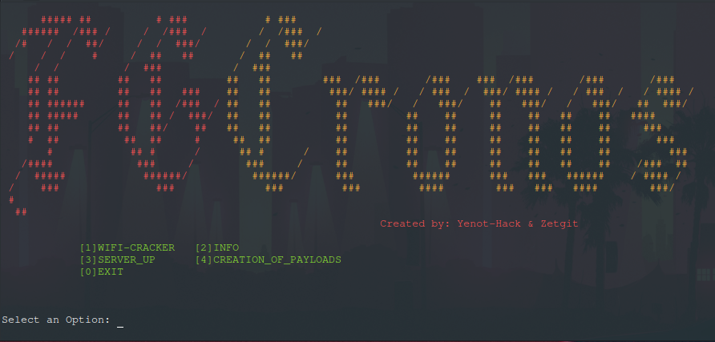

# FGcronos
### Created by Yenot-Hack
 </br>
<p align="center">
  
</p>
</br>
<p>this script automates tasks, has 4 options, scans the network, mounts apk payloads on the apache server and in ngrok,
 captures the handshake of a victim wifi network to crack the password, raises a local server (apache) for attacks on the local network
 and the ngrok for attacks outside the lan network, will acquire the option to modify the DNS's of the local server for Man In The Middle attacks.</p>
> Wifi-Cracker </br>
> Scan network </br>
> Mount payloads on apache server and outside lan </br>
> Apache server

#### Installation

- Clone the repository
```
$ 𝚐𝚒𝚝 𝚌𝚕𝚘𝚗𝚎 𝚑𝚝𝚝𝚙𝚜://𝚐𝚒𝚝𝚑𝚞𝚋.𝚌𝚘𝚖/𝚈𝚎𝚗𝚘𝚝-𝙷𝚊𝚌𝚔/𝚏𝚐𝚌𝚛𝚘𝚗𝚘𝚜
```
</br>

- Enter the repository
```
$ 𝚌𝚍 𝚏𝚐𝚌𝚛𝚘𝚗𝚘𝚜
```
</br>

- Give execution permissions
```
$ 𝚌𝚑𝚖𝚘𝚍 +𝚡 $𝙿𝚆𝙳/*
```
</br>

- Run the installer
```
$ ./𝚒𝚗𝚜𝚝𝚊𝚕𝚕.𝚜𝚑
```
</br>

Usage:
to run the tool just write the command fgchronos 
```
𝚏𝚐𝚌𝚛𝚘𝚗𝚘𝚜
```

### Dependencies
>- dependencies are installed as soon as the installer is run 

###### This script is not supported for termux, yet
